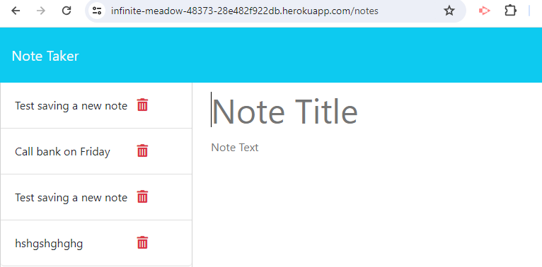

# Note Taker

## Description

Note taker is a webpage to write and save notes. It uses an Express.js back end and will save and retrieve note data from a JSON file.

## Installation

Follow the below steps to install on local computer.
- Step 1: clone project to your local computer.
- Step 2: run "npm install" to install the required modules (express, uuid).
- Step 3: run "npm start" to run a local webpage at http://localhost:3001 
    
## Usage

- Step 1: Use the link https://infinite-meadow-48373-28e482f922db.herokuapp.com/ or local link as local installation
- Step 2: click on Get Start button to start using it.
- Step 3: existing notes listed in the left-hand column, in the right-hand column there are empty fields to enter a new note title and the note’s text.
- Step 4: After filling the note title and text, click on "Save Note" button to save or "Clear Form" button to clear the filling information. These buttons are at the top of the page.
- Step 5: To see the existing note, click on it in the left-hand column.
- Step 6: To delete the existing note, click on the bin icon at same line with the note.

    

## Credits

Backend powered by [nodejs](https://nodejs.org/en), and [express](https://www.npmjs.com/package/express).

Unique id sourced from [uuid](https://www.npmjs.com/package/uuid).